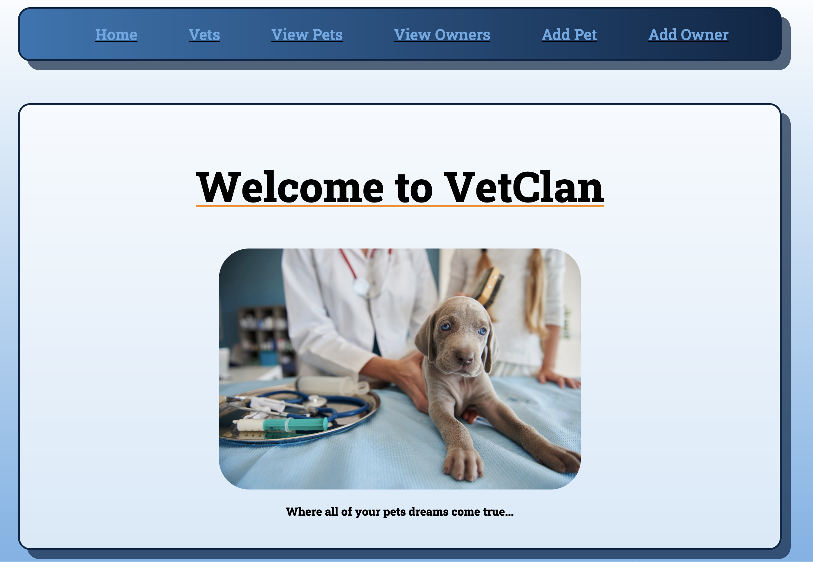
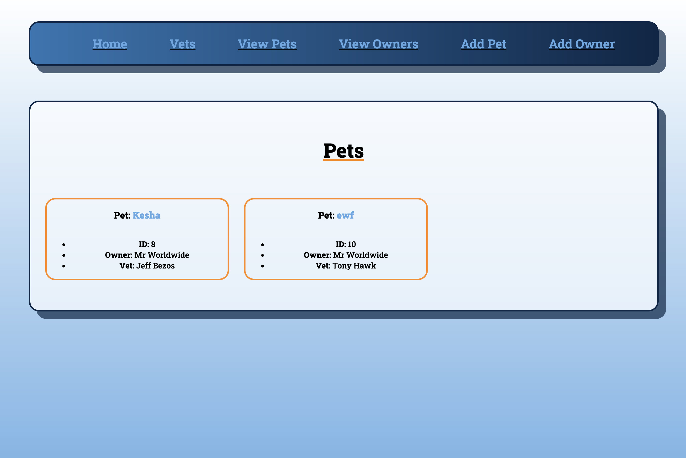
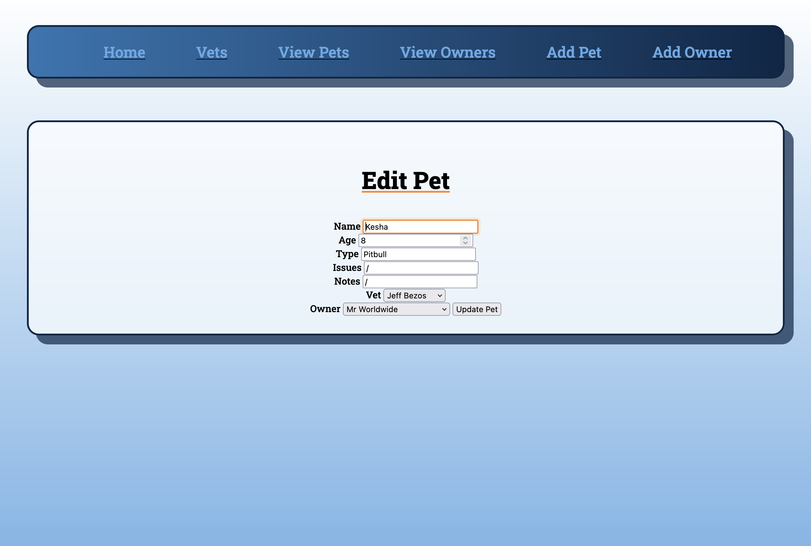
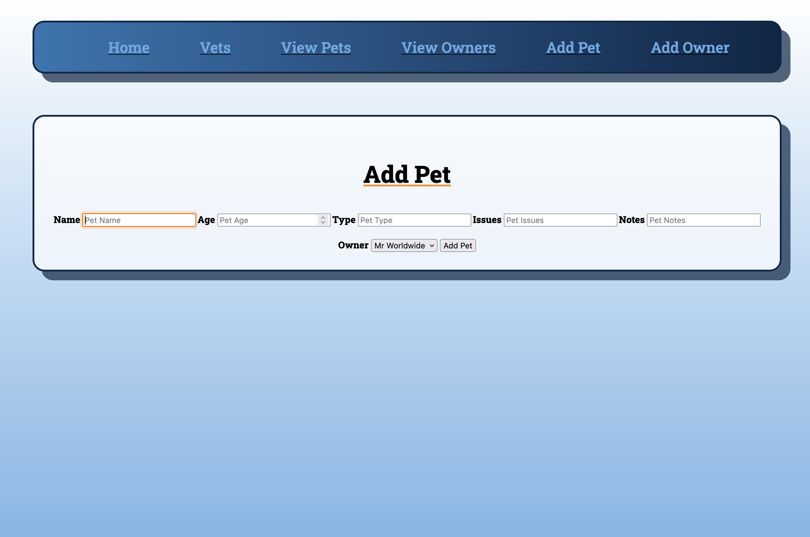

<h1>VetClan</h1>
<h2>A CodeClan project by Lewis Halstead</h2>

<i>This project was created using Pythons web framework Flask.</i>

The aim for the project was to create a CRUD (Create, Read, Update, Delete) application using Flask using the concepts that we had learnt in the previous weeks.

Running app locally by cloning repo

Step one - clone repository from github.
Step two - pip install flask.
Step three - create a database (recommened naming it veterinary_db or similar).
Step four - type 'psql -d (your-database-name) -f veterinary_db.sql' into the terminal. Make sure to use the name of the database you created.
Step five - type 'flask run'. If this command doesn't work try 'python3 -m flask run'.
Step six - the web-app will now be running locally using port 5000. Clicking the link created in the terminal will open the relevent page.
Step seven - enjoy and admire.